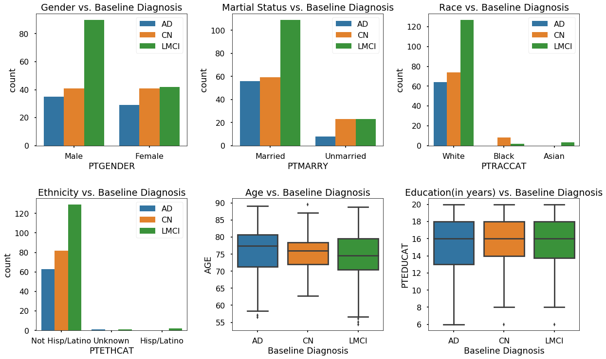
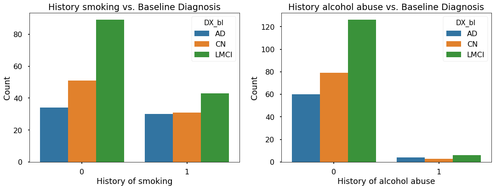

# EDA
## Contents
[0.Import Libraries](#cdrsb1)<br>
[1.Load, Preprocess, Merge, and Split data](#cdrsb1)<br>
[2.Perform EDA to select potential predictors](#cdrsb1)<br>
    [a.)Demographics Characteristics](#cdrsb1)<br>
    [b.)Outcome: Baseline Diagnosis of Alzheimer's Disease](#cdrsb1)<br>
    [c.)Lifestyle factors (from medical history dataset)](#cdrsb1)<br>
    [d.)Neurocognitive/neuropsychological assessments](#cdrsb1)<br>
    [e.)Cerebrospinal fluid (CSF) Biomarkers](#cdrsb1)<br>
    [f.)Imaging factors](#cdrsb1)<br>
    [g.) Genetic factors](#cdrsb1)<br>
</ul>


## <a name="Import libraries"></a> 0. Import libraries

```py
import numpy as np
import pandas as pd
import matplotlib.pyplot as plt
import seaborn as sns
%matplotlib inline
sns.set_context('poster')

# set color palette
dpal = sns.choose_colorbrewer_palette(data_type='diverging', as_cmap=True)
```
## <a name="Load, Preprocess, Merge, and Split data"></a> 1. Load, Preprocess, Merge, and Split data
```py
# KEY ADNI table with age, gender, ethnicity, race, education, marital status, and APOE status
# ADNIMERGE data contains part of biomarker data, part of Neuropsychological data, and key feature in FAQ dataset
adnimerge=pd.read_csv('ADNIMERGE.csv',low_memory=False)
# Create a binary variable for maritial status and for gender
adnimerge['PTMARRY'] = np.where(adnimerge['PTMARRY']=='Married','Married','Unmarried')
adnimerge_bl= adnimerge[adnimerge['VISCODE'] == 'bl']

# Biomarker 
biomarker = pd.read_csv('UPENNBIOMK_MASTER.csv')
biomarker_bl = biomarker.loc[(biomarker['VISCODE'] == 'bl') & (biomarker['BATCH'] == 'MEDIAN')]

# Medical History table with smoking and alcohol abuse variables
mh = pd.read_csv('MEDHIST.csv') 
mh = mh[mh.duplicated(subset='RID',keep='first')==False]

# Neuropsychological
item = pd.read_csv('ITEM.csv')
item_sub = item.loc[:,['RID','VISCODE','TMT_PtA_Complete','TMT_PtB_Complete','AVLT_Delay_Rec']]
item_bl = item_sub.loc[(item_sub['VISCODE'] == 'bl')]

# merge datasets
data = pd.merge(adnimerge_bl, biomarker_bl, how='inner', on='RID')
data = pd.merge(data, mh, how='inner', on=['RID'])  
data = pd.merge(data, item_bl, on='RID', how='inner')

# Split data into training and test set - All the EDA are performed on the training set
np.random.seed(9001)
msk = np.random.rand(len(data)) < 0.75
data_train = data[msk]
data_test = data[~msk]

print('The sample size of full dataset is %.d.' % data.shape[0])
print('The sample size of training set is %.d (%.2f' % (data_train.shape[0], 
                                                        (100*data_train.shape[0]/data.shape[0])),'%).')
print('The sample size of test set is %.d (%.2f' % (data_test.shape[0], 
                                                        (100*data_test.shape[0]/data.shape[0])),'%).')
                                                        
data_train.to_csv('data_train.csv')
data_test.to_csv('data_test.csv')
```
## <a name="Perform EDA to select potential predictors"></a> 2. Perform EDA to select potential predictors
## <a name="a. Demographics Characteristics"></a>a. Demographics Characteristics
## <a name="Outcome: Baseline Diagnosis of Alzheimer's Disease"></a> Outcome: Baseline Diagnosis of Alzheimer's Disease

```py
bldx_df=pd.DataFrame(index=['Baseline Diagnosis Prevalence'],columns=['CN','AD','LMCI'])
bldx_df.CN=np.mean(data_train['DX_bl']=='CN')
bldx_df.AD=np.mean(data_train['DX_bl']=='AD')
bldx_df.LMCI=np.mean(data_train['DX_bl']=='LMCI')
bldx_df
```	
```Markdown
                                CN	        AD          LMCI 
Baseline Diagnosis Prevalence	0.294964	0.230216	0.47482
```

```py
# plots for demographics characteristics within each baseline diagnosis group

demo_cont_name = ['AGE', 'PTEDUCAT']
demo_cat_name = ['PTGENDER', 'PTMARRY', 'PTRACCAT', 'PTETHCAT']
demo_cont_title = ['Age vs. Baseline Diagnosis', 'Education(in years) vs. Baseline Diagnosis']
demo_cat_title = ['Gender vs. Baseline Diagnosis', 'Martial Status vs. Baseline Diagnosis', 
                  'Race vs. Baseline Diagnosis', 'Ethnicity vs. Baseline Diagnosis']

fig, axd = plt.subplots(2,3,figsize=(20,12))
plt.subplots_adjust(hspace=0.4, wspace=0.3)
axd = axd.ravel()
for i in range(4):
    datai = data_train[[demo_cat_name[i], 'DX_bl']]
    sns.countplot(ax=axd[i], x=demo_cat_name[i], hue='DX_bl', data=datai)
    axd[i].set_title(demo_cat_title[i])
    axd[i].legend(loc='upper right')
for i in range(2):
    datai = data_train[[demo_cont_name[i], 'DX_bl']]
    sns.boxplot(ax=axd[i+4], x='DX_bl', y=demo_cont_name[i], data=datai)
    axd[i+4].set_xlabel('Baseline Diagnosis')
    axd[i+4].set_title(demo_cont_title[i])
```


```Markdown
###Interpretation
Outcome: There is only three types of basline diagnosis status for people in ADNI1 stage.
Gender: Male and female seems to have different patterns of baseline diagnosis. Therefore, we select gender as our potential predictor.
Marital Status: Based on the countplot, married people seem to have different patterns of baseline diagnosis comparing to unmarried people. We select Martial Status as our potential predictor.
Race: Again, the majority of people in our training set is 'White'. We do not have sufficient power to observe the pattern of baseline diagnosis across different race groups.
Ethnicity: The majority of people in our dataset is 'Non-Hispanic/Latino'. There is no Hispanic/Latino individuals in our training set. We do not have sufficient power to observe the pattern of baseline diagnosis across different ethnicity groups.
Age: Based on the boxplot, Age seems to have different distribution in different baseline diagnosis groups. Therefore, we select age as our potential predictor.
Education: There is no apparent relationship between Education and baseline diagnosis.

###Variable Selection
We select Age, Gender and Marital Status as potential predictors.
```
## <a name="b. Lifestyle factors"></a> b. Lifestyle factors (from medical history dataset)
```py
plt.figure(figsize=(18,6))

# History of smoking vs. Last Diagnosis
plt.subplot(121)
data_smo = data_train[['MH16SMOK','DX_bl']]
sns.countplot(x='MH16SMOK', hue="DX_bl",data=data_smo)
plt.title('History smoking vs. Baseline Diagnosis')
plt.xlabel('History of smoking')
plt.ylabel('Count') 

# History of alcohol abuse vs. Last Diagnosis
plt.subplot(122)
data_alc = data_train[['MH14ALCH','DX_bl']]
sns.countplot(x='MH14ALCH', hue="DX_bl",data=data_alc)
plt.title('History alcohol abuse vs. Baseline Diagnosis')
plt.xlabel('History of alcohol abuse')
plt.ylabel('Count') ;
```


```Markdown
###Interpretation
Baseline smoking: Based on the countplot, people who smoke are more likely to have baseline diagnosis of LMCI. We should include Baseline smoking as potential predictor.
Baseline alcohol abuse: The majority of the people in this dataset do not have history of alcohol abuse. We do not have sufficient power to observe the pattern of baseline diagnosis across different alcohol abuse status.
###Variable Selection
We select Baseline smoking as potential predictor.
```

## <a name="Neurocognitive/neuropsychological assessments"></a> c. Neurocognitive/neuropsychological assessments
```Markdown
For neurocognitive/neuropsychological predictors, we first plot their histogram, second present their boxplot within each baseline diagnosis group, then calculate their correlations.
```
## <a name="1. Histogram"></a> 1. Histogram

# plot the histogram of these predictors:
```py
neu_predictors = ['MMSE_bl','RAVLT_learning_bl','RAVLT_immediate_bl','RAVLT_forgetting_bl',
              'RAVLT_perc_forgetting_bl','AVLT_Delay_Rec','ADAS11_bl','ADAS13_bl','TMT_PtA_Complete',
             'TMT_PtB_Complete','CDRSB_bl','FAQ']

# drop some extreme values for several predictors
data_neuro = data_train[['DX_bl'] + neu_predictors].dropna()
data_neuro = data_neuro[(data_neuro['AVLT_Delay_Rec'] < 800) & (data_neuro['TMT_PtA_Complete'] < 800)
                       & (data_neuro['TMT_PtB_Complete'] < 800)]

neu_xlabels = ['Baseline MMSE score','RAVLT scores \n Learning','RAVLT scores \n Immediate Recall',
         'RAVLT scores \n Forgetting','RAVLT scores \n Percent Forgetting','AVLT Delayed \nRecognition score',
         'Baseline ADAS11','Baseline ADAS13','Trail making test \nA score','Trail making test \nB score',
         'Clinical Dementia \nRating score','Functional Activities \nQuestionnaire (FAQ) score']

fig, axn1 = plt.subplots(3,4,figsize=(20,10))
fig.suptitle('Histogram of several predictors with their mean (training set)', fontsize=20)
plt.subplots_adjust(hspace=0.7,wspace = 0.4)
axn1 = axn1.ravel()
for i in range(len(neu_predictors)):
    data_neuro[neu_predictors[i]].hist(ax=axn1[i], alpha=0.7, bins=10, label='Histogram', grid=False)
    axn1[i].axvline(data_neuro[neu_predictors[i]].mean(), 0, 1.0, color='red', label='Mean')
    axn1[i].set_xlabel(neu_xlabels[i],fontsize=15)
    axn1[i].set_ylabel('Frequency',fontsize=14)
```
